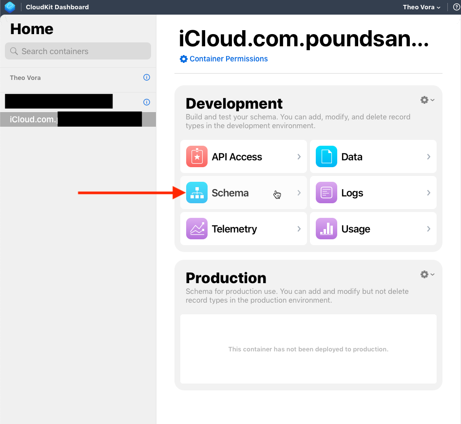
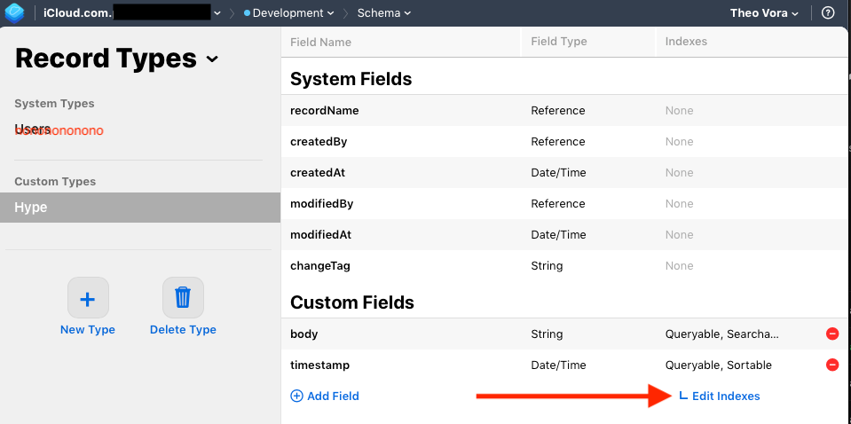

# Set Schema in CloudKit

Got a Bad Container error?

You'll need to run your app in Simulator at least once in order for CloudKit to become aware of your Model's properties. Don't jump the gun (like I did) and try to set this up right after you create the CloudKit container! Get to a point where your app is functional, then run in Simulator, then follow the steps below.

## Steps

### 1. Login to CloudKit Dashboard

### 2. Select your container.

### 3. Click Schema. (Mine was under Development)

### 4. Select *your Model* under *Custom Types*. Click Edit Indexes.

### 5. Click Add Index. 
*recordName and QUERYABLE will appear*.

### 6. Click Save Changes.

### 7. That's it!

